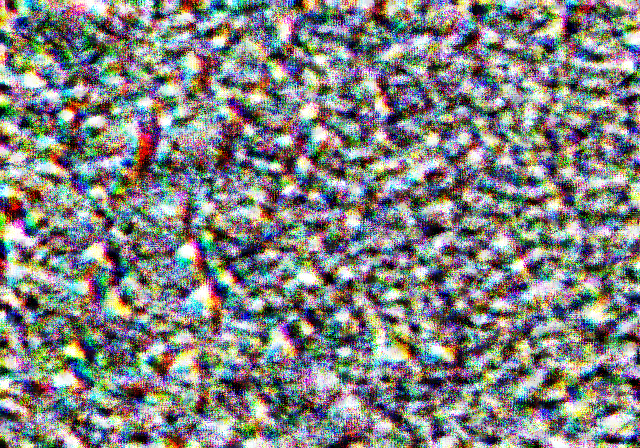
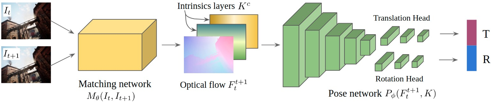

# Universal Adversarial Attacks on Visual Odometry (TartanVO)


*The final optimized adversarial patch*


*The internal structure of TartanVO, the attacked visual odometry model*

This repository contains the code to train, evaluate and test a universal adversarial patch on the visual odometry model TartanVO. The code is based on the original code of the paper "Physical Passive Patch Adversarial Attacks on Visual Odometry Systems" (https://arxiv.org/abs/2207.05729). The original code can be found at the following link:
https://github.com/patchadversarialattacks/patchadversarialattacks

The main changes compared to the original version are:
1. the introduction of a new loss function
2. the attack on the estimate of rotation
3. the integration of momentum in the optimizer

Overall, the patch achieves a $214\%$ mean RMS adversarial to clean ratio.

Please see the [report](report.pdf) for a complete discussion. 
### Guidelines to reproduce the results
#### `src/` folder structure
The folder ```src/``` is organized as follows:
- ```attack/``` is the folder that contains the implementation of the training of the universal adversarial patch. In particular from the original code, we have **modified** `attack.py` and `pgd.py` in order to implement our attack scheme
- `data/` is an empty folder where it is necessary to place data
- `Datasets` is the folder that contains the code that deals with the processing of the data. In particular from the original code, we have made a few modifications to `tartanTrajFlowDataset.py` but these latter are not significant.
- `docker` is the folder that deals with docker. We did not modify any file present in this folder
- `evaluator` is the folder that deals with the evaluation of the performance of the patch. We did not modify any file present in this folder
- `models` is the folder that contains the TartanVO model. We did not modify any file present in this folder
- `Network` is the folder that deals with the activation of the model. We did not modify any file present in this folder
- `loss.py` is the python file which deals with the definition of the loss and the coefficients of this latter. We have **modified** this file by inserting our novel losses.
- `run.sh` is a shell file whose job is to start the program by means of sbatch. It also contains all of the **flags** that are passed to the program.
- `run_attacks.py` is the python file which contains the main function and orchestrate the rest of the files. In this file we have inserted several **modifications** aimed at making use of the validation and the testing data
- `TartanVO.py` is the python file which deals with the activation of TartanVO. We did not modify any part of this file
- `tartanvo_node.py` is the python file which leverages the API of ROS to activate TartanVO. We did not modify any part of this file
- `utils.py` is the python file which deals with the parsing and the computation of the arguments. We **modified** this file in order to be able to create an evaluation and a testing set

#### Steps required to reproduce the training and the evaluation of the code
##### Where to get the data
In order to have more datapoints to train, evaluate and test our patch, we have got the data by cloning the repository in Github of the original paper, under the [**synthetic**](https://github.com/patchadversarialattacks/patchadversarialattacks/tree/main/data/3sec_on_ring_r50m) data folder.
##### Where to place the data
The data (all of it, hence the training, the evaluation and the testing set) must be placed under a folder inside the `data/` folder. For example, if we choose to give the name `dataset/` to the folder that contains the data, then the data must be put in the following path: `data/dataset/`.
It is important to conserve the convention used in the original code that was handed to us, hence it is important to **divide** the **trajectories** **in subfolders** which can be later split between training, evaluation and testing. For example, we can create 10 subfolders titled with the numbers from 0 to 9 (for example, a single trajectory could be stored in the folder `data/dataset/0/`). Later, it is possible to assign some folders to the training set, other folders to the evaluation set and yet other folders for the testing set. 
In our case, using the aforementioned data, we have made the following assignment:
- 2,4,6,7,8,9 to the training set (`utils.py, Line 161`)
- 3,5 to the validation set (`utils.py, Line 176`)
- 0,1 to the testing set (`utils.py, Line 189`)
##### How to train, evaluate and test the patch
All of these operations (training, evaluating and testing) are made by the same program which is invoked by calling `run.sh`. 

The name of the folder under which the data is placed must be specified after the flag "--test-dir". In the submitted file we have left "dataset" just for the purpose of an example.

By following the original API that was handed to us, we have left the freedom of specifying how to split the indices of the trajectories. In particular, to modify the indices of the *training* set you have to modify `utils.py, Line 157`, to modify the indices of the *evaluation* set you have to modify `utils.py, Line 172`, and to modify the indices of the *testing* set you have to modify `utils.py, Line 185`.
All of the flags that can be set at the beginning of the program, can be modified in `run.sh, Line 37`. 

**ATTENTION**: we overrided the **factors** and the **functions** **used in the loss** passed in the flags, hence to set a different coefficient to the loss or to change a function used in the loss, it is not possible to set the appropriate flags in `run.sh`.

To change the factors and the functions used in the *training* loss you can change `attacks/pgd.py, Line 197`, whereas to set the factors and the functions used in the *evaluation* loss you can change `attacks/pgd.py, Line 205`. The *testing* loss cannot be changed.

After launching, the training and the evaluation loss will be displayed in stdout. 
The testing loss will be available under the folder `results/` as *csv* files whose names follow the pattern: 'testresults_' + crit_str + '.csv'


